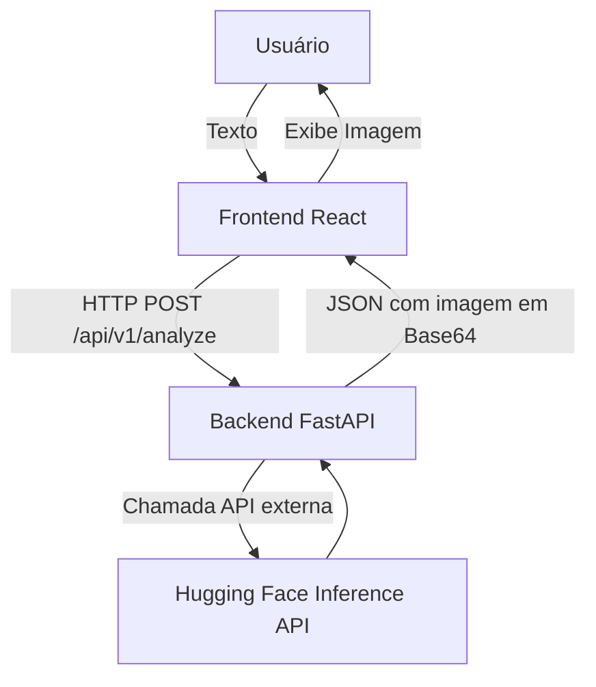
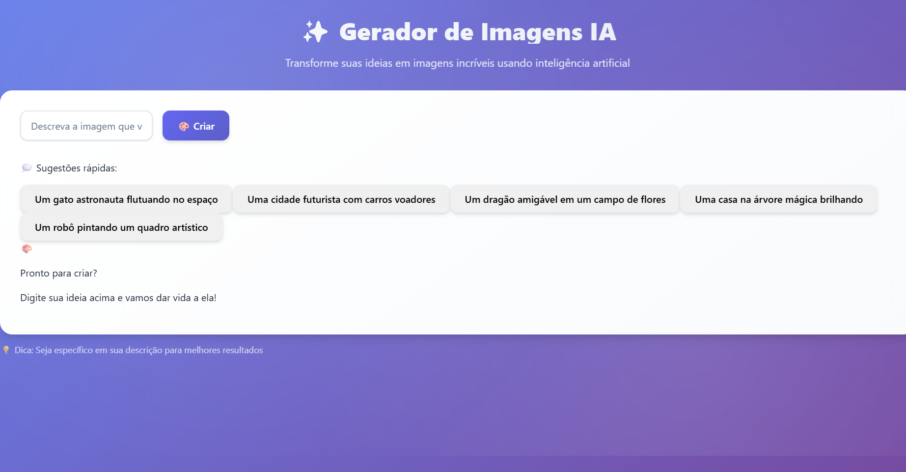
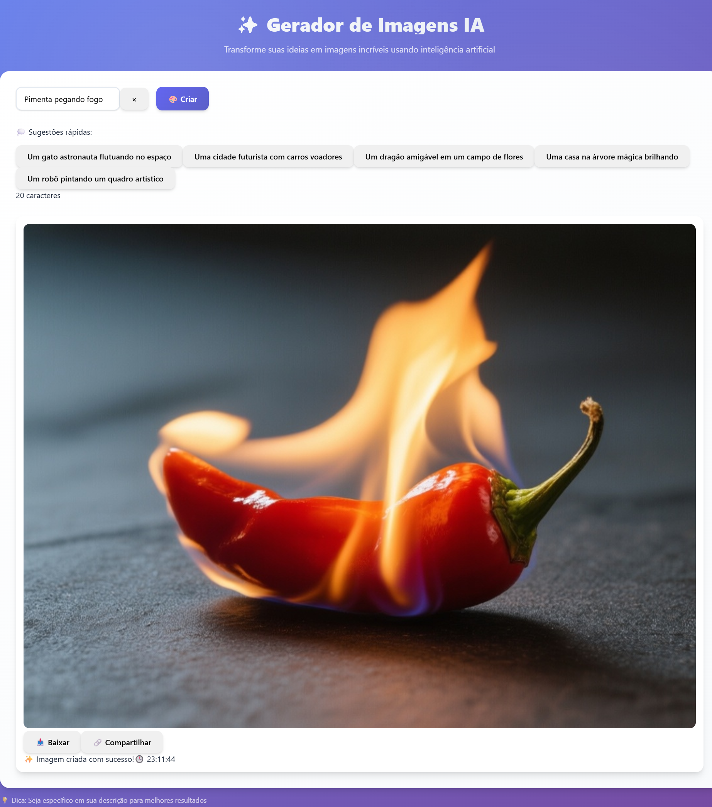

# 🚀 Text-to-Image Full-Stack App

Aplicação **full-stack** simples que recebe um **texto** do usuário, envia para um **back-end em FastAPI**, que processa via **Hugging Face Inference API** (modelo `Qwen/Qwen-Image`) e retorna uma **imagem gerada por IA**. O **front-end em React** consome a API e exibe o resultado.

---

## 📌 Visão Geral da Arquitetura



* **Frontend (React + Vite)**: SPA simples com campo de texto, botão de envio, estado de loading, exibição de erros e resultado (imagem).
* **Backend (FastAPI)**: API com duas rotas:

  * `GET /api/v1/healthz` → health check.
  * `POST /api/v1/analyze` → recebe texto, chama Hugging Face, retorna imagem em base64.
* **Integração de IA**: decisão foi usar **API externa** (Hugging Face Inference API) ao invés de rodar modelo local, por simplicidade e compatibilidade.

---

## ⚙️ Como rodar o projeto

### 🔹 1. Clonar o repositório

```bash
git clone https://github.com/Pimenta15/selecao-dev-fullstack-unicap.git
cd selecao-dev-fullstack-unicap
```

### 🔹 2. Backend (FastAPI)

```bash
cd backend
python -m venv venv
source venv/bin/activate   # (Linux/Mac)
venv\Scripts\activate      # (Windows)
pip install -r requirements.txt
```

Criar arquivo `.env` na pasta `backend`:

```env
HF_API_KEY=seu_token_huggingface_aqui
```

Rodar servidor:

```bash
uvicorn app.main:app --reload
```

A API ficará em `http://127.0.0.1:8000`.

### 🔹 3. Frontend (React)

```bash
cd frontend
npm install
npm run dev
```

A aplicação estará em `http://localhost:5173`.

---

## 🔍 Exemplos de uso da API

### Health Check

```bash
curl http://127.0.0.1:8000/api/v1/healthz
```

Resposta:

```json
{ "status": "ok" }
```

### Gerar Imagem via Texto

```bash
curl -X POST "http://127.0.0.1:8000/api/v1/analyze" \
-H "Content-Type: application/json" \
-d '{
  "task": "text-to-image",
  "input_text": "um gato astronauta no espaço",
  "use_external": true
}'
```

Resposta:

```json
{
  "id": "c8f6b7c3-8e21-4db3-b29b-4fb8cf2b9cda",
  "task": "text-to-image",
  "engine": "external:Qwen/Qwen-Image",
  "result": {
    "image_base64": "iVBORw0KGgoAAAANSUhEUgAABVYAAAL..."
  },
  "elapsed_ms": 2500,
  "received_at": "2025-09-18T20:00:00Z"
}
```

### Testando com Postman

* Método: `POST`
* URL: `http://127.0.0.1:8000/api/v1/analyze`
* Body → raw JSON:

```json
{
  "task": "text-to-image",
  "input_text": "um castelo medieval feito de sorvete",
  "use_external": true
}
```

---

## 📦 Estrutura do Projeto

```
root/
 ├── backend/
 │   ├── app/
 │   │   ├── main.py        # FastAPI app
 │   │   ├── routes.py      # Rotas
 │   │   ├── schemas.py     # Pydantic models
 │   │   ├── services.py    # Lógica de IA (Hugging Face)
 │   │   └── utils.py       # (helpers)
 │   ├── requirements.txt
 │   └── .env.example
 ├── frontend/
 │   ├── src/
 │   │   ├── api.js
 │   │   ├── App.jsx
 │   │   └── components/
 │   │       ├── PromptForm.jsx
 │   │       └── ResultView.jsx
 │   └── package.json
 └── README.md
```


## 🖼️ Exemplo do sistema em funcionamento







---

## ✅ Checklist

* [x] Backend FastAPI com rota `/api/v1/analyze` funcional.
* [x] Integração real com Hugging Face Inference API.
* [x] Frontend em React exibindo imagem, loading e erros.
* [x] Documentação com exemplos de execução.

---

## 📝 Notas

* O backend usa **API externa** (Hugging Face), logo é necessário um **token válido** (`HF_API_KEY`).
* Não commitar `.env` real — apenas `.env.example`.
* Projeto estruturado para ser simples, claro e funcional como MVP.


